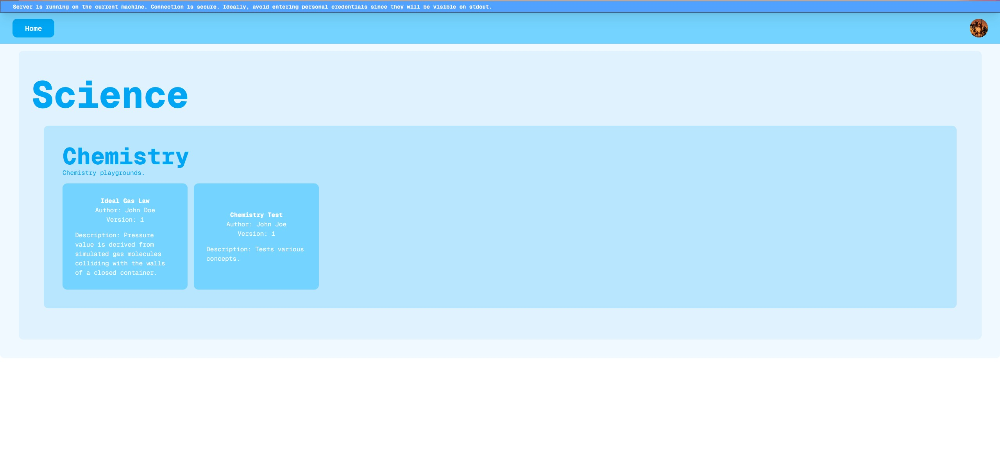
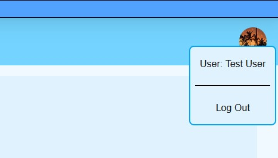
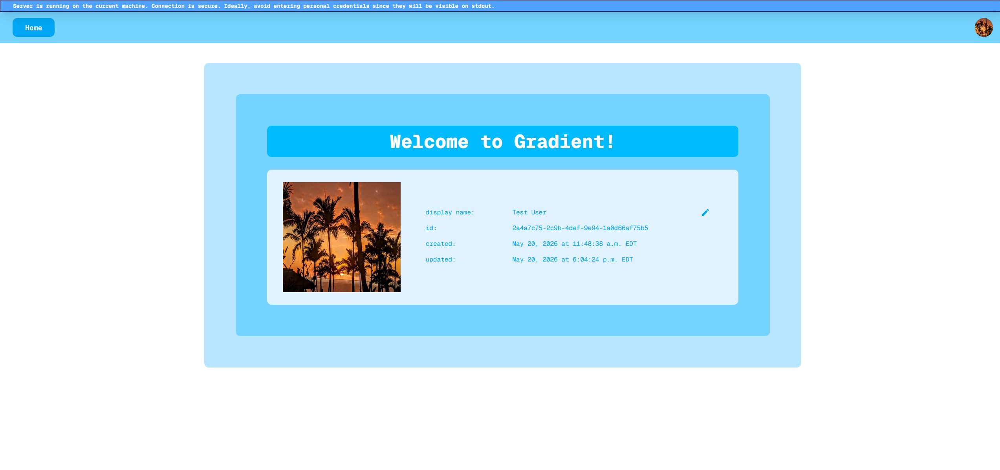
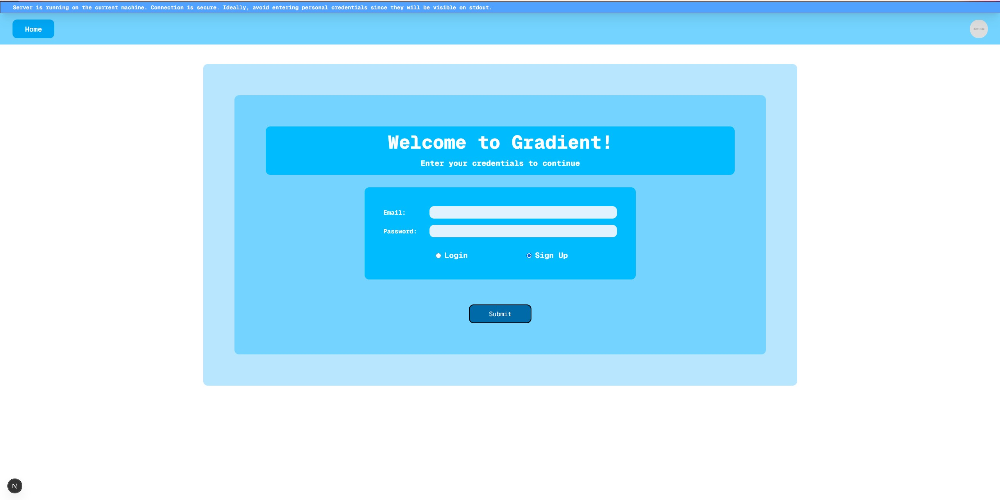

# Gradient

An online learning platform for math, science, and engineering with collaborative demos.

## Development

### Docker Development

1. Ensure Docker and Docker Compose are installed

2. `cp .env.dev.example .env.dev`, fill out any sections marked with "REQUIRED"

3. Start a local Supabase server `supabase start -x "vector"`

4. Generate supabase helper types `supabase gen types typescript --local > apps/frontend/src/lib/supabase/database.types.ts`

5. Start development server `docker compose --env-file .env.dev -f docker-compose.dev.yaml up --watch` (may require elevated permissions)

Watch supports:

- frontend-dev

Other services need to be manually restarted with:

`docker compose -f docker-compose.dev.yaml restart <service-name>`

## Preliminary UI Design

